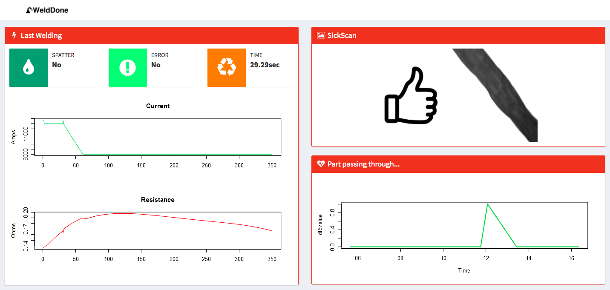
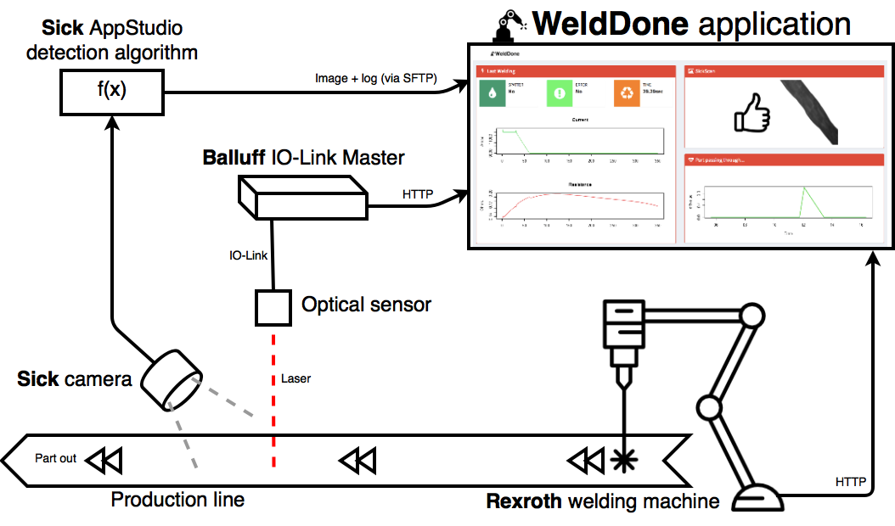
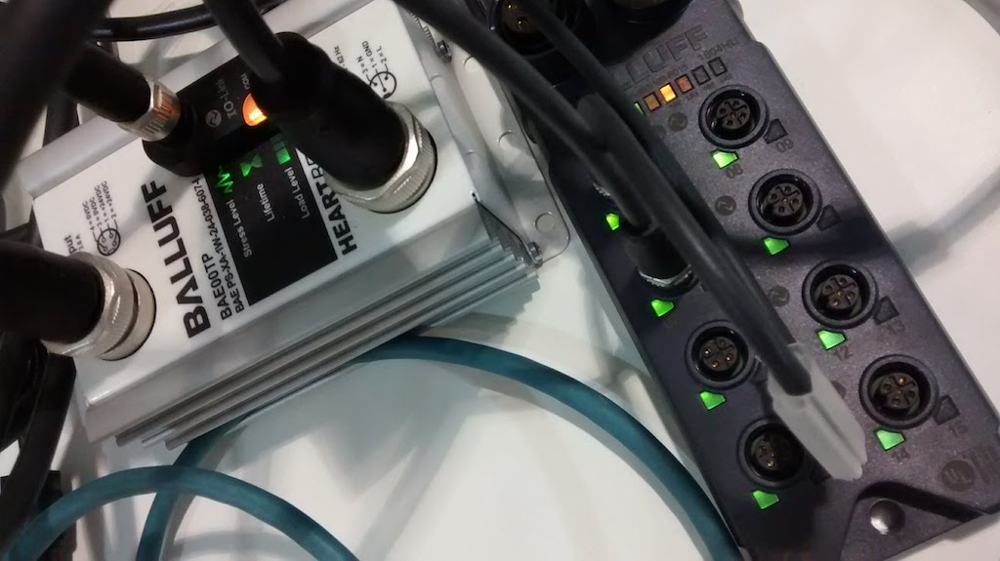
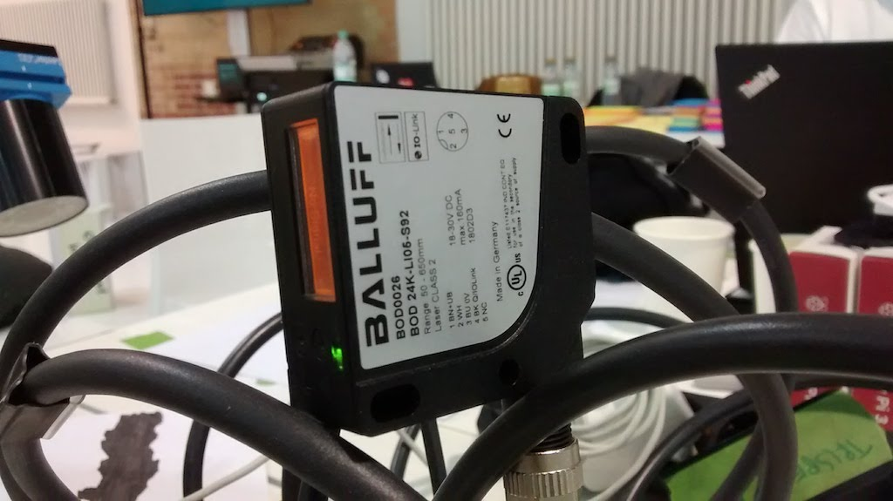
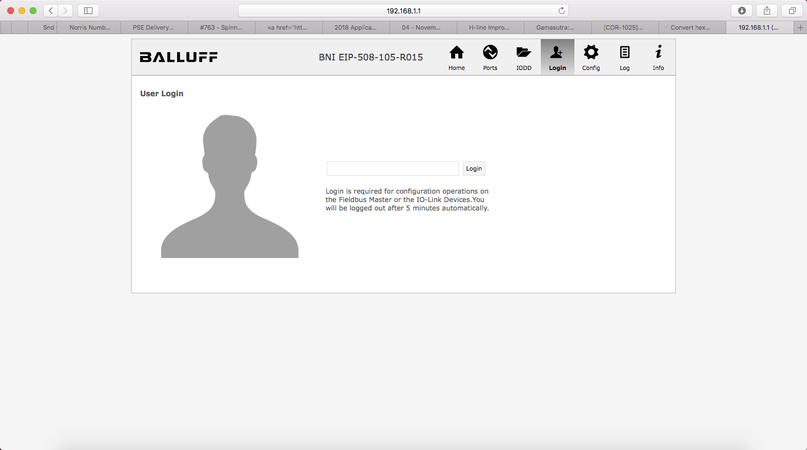
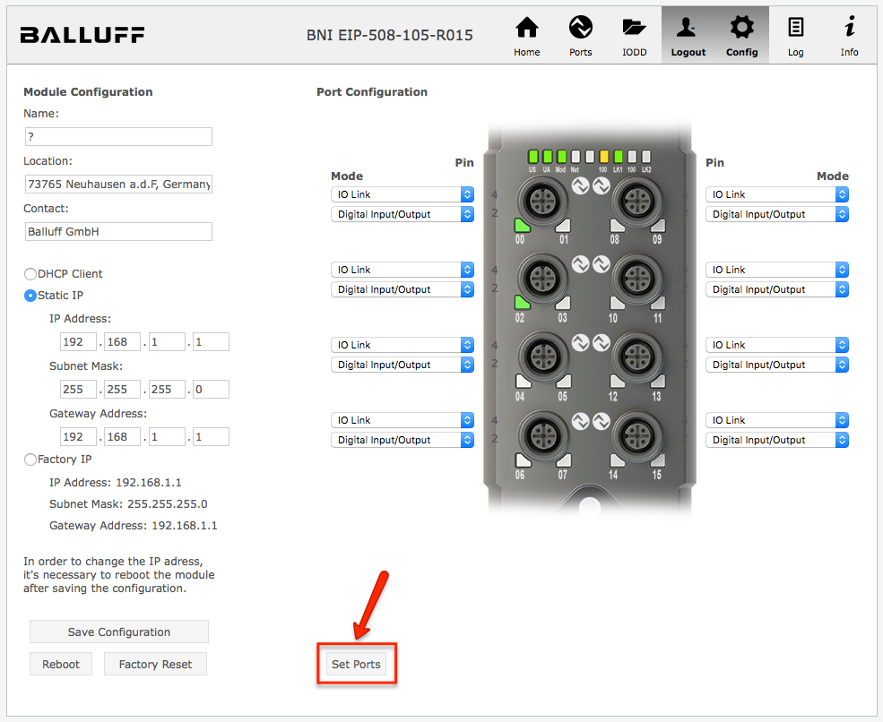
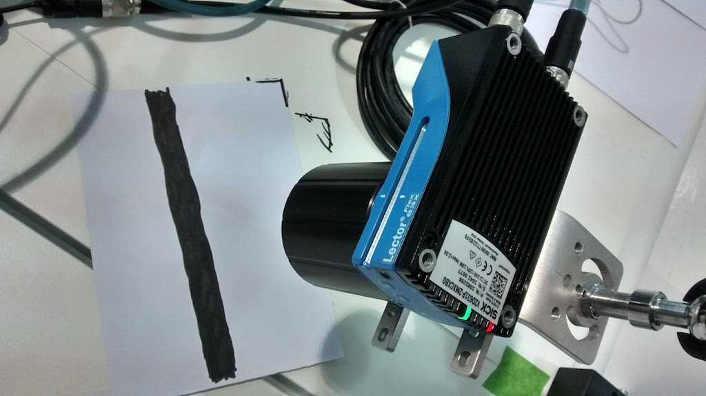
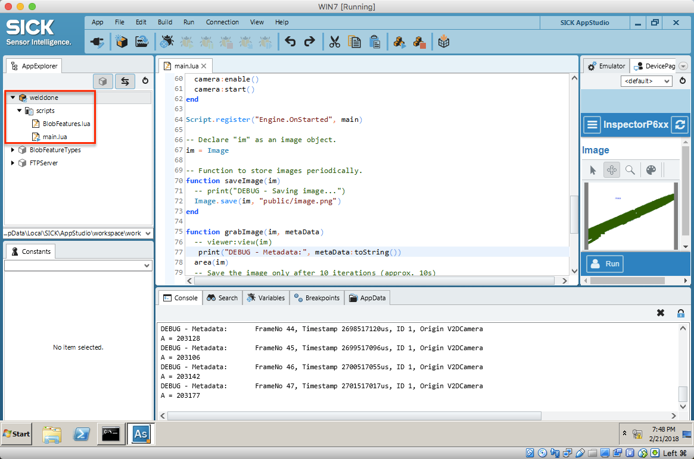
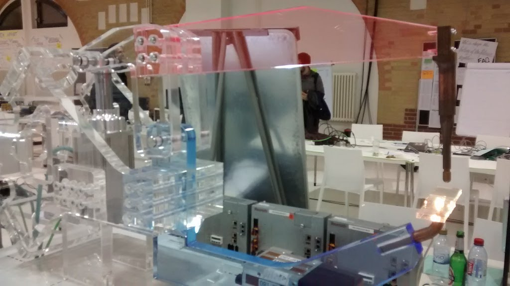
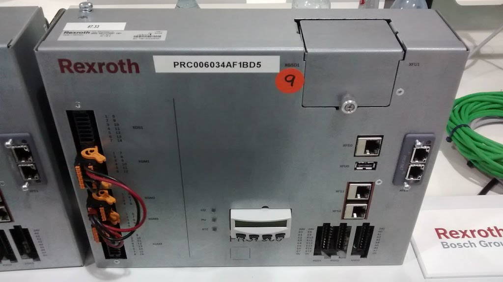

# WeldDone

### By Team _Boschebol_

_A project by Emelie Hofland and Jaime González-Arintero. Winner of the Manufacturing 4.0 challenge at the [BCX 18 hackathon](http://bcw.bosch-si.com/berlin/hackathon/) in Berlin, on February 20-22, 2018._

## Introduction

This project combines **real-time welding data with image recognition to increase the accuracy detecting rejects in production lines**. Just a simple proof of concept developed in less than two days, but using real industrial-grade hardware.

And this is how the *WeldDone* dashboard looks like:

Every time that a part is produced, this event is detected by a Balluff optical sensor. Then, the data of the welding process is retrieved from a Rexroth controller. At the same time, a real-time image of the finished part is taken using a Sick camera.

An algorithm processes the image, and detects if the part passes the quality control on the right side, while the welding data is analyzed, displaying the production values and other indicators at the left.

## Business Presentation

**The video pitch is available in YouTube.** Just click on the picture below.

This presentation was made about one hour before the hackathon deadline in Google Slides. After that, the screen was captured while the voice and the (live!) ukulele music were recorded. *For the startup feeling, you know.*

## Solution Architecture

## Technical Setup

### Network Configuration

For simplicity, this project runs in a computer with two network interfaces: The existing infrastructure at the hackathon location (subnet `100.102.5.XXX`) and a local network for the wired devices (subnet `192.168.1.XXX`). The devices are distributed as follows:

* `192.168.1.1`: Balluff BNI EIP-508-105-R015 IO-Link Master
* `192.168.1.2`: Sick InspectorP631 Flex 2D Camera
* `192.168.1.99`: Host running the R/Shiny application
* `100.102.5.8`: Rexroth Welding Machine API

### Balluff IO-Link Setup

The Balluff IO-Link setup used in this project consists on the following:

* [BNI EIP-508-105-R015 Master](http://usa.balluff.com/manuals/BNI%20Network%20Blocks/EtherNet%20Blocks/BNI%20EIP-508-105-Z015_EN.pdf)
* [BOD0026 Optical Sensor](https://assets.balluff.com/WebBinary1/DRW_937310_00_000.pdf)
* [BAE00TP Power Supply](http://assets.balluff.com/WebBinary1/346006.pdf)

After connecting the sensor and the power supply to the master, we will need to set the IO-Link ports. This can be done easily accessing to the web server of the master. To do so, **open a browser and head to the IP address of the master**, in our case `192.168.1.1`. On the main menu, first click on **"Login"**.

On the text field, introduce **BNIEIP** and press enter. Once logged in, head to **"Config"**, and at the bottom of this menu, click on **"Set Ports"**.

The device should be ready now. Since the optical sensor is connected to port 0, to retrieve data from the built-in API of the IO-Link Master, it's enough to make an HTTP GET on: `http://192.168.1.1/port0.jsn`. 

This request will return a JSON including the operational and process values of the sensor. The distance read by the sensor is _encapsulated_ in the first two bytes of the process inputs. Converting this value to integer will provide us with the distance in millimiters.

Additional documentation of the built-in API can be found on [this reference manual](https://github.com/chronoclast/welddone-bcx18-hackathon/blob/master/assets/balluff-ports-jsn.pdf).

### Sick Camera

The [Sick InspectorP631 Flex camera](https://www.sick.com/de/en/vision/2d-vision/inspectorp63x/c/g401751) can run image processing algorithms on the device itself. Besides, it can communicate with other devices or services using several protocols, including MQTT, HTTP, and more. 

In this project, the images and the log file (with the result of the quality control test) are provided to the WeldDone application via an FTP server.

The program running on the camera is written in Lua, and can be flashed on the device using Sick AppStudio. The code can be found in the folder `sick-camera`, under the name [`main.lua`](https://github.com/chronoclast/welddone-bcx18-hackathon/blob/master/sick-camera/main.lua).

**Sick AppStudio requires a 64-bit Windows machine.** After installing it, and activating it using a valid licence, make sure to replicate the folder structure as shown below:

Once ready, transfer the app to the device. The device must have the IP address `192.168.1.2` so the WeldDone application can successfully log into the FTP server and retrieve the images and the log.

### Rexroth Welding Machine API

This device makes available welding data via an endpoint, and such data can be retrieved on-demand. To retrieve the data from the last welding, simply make an HTTP GET request to: `http://100.102.5.8:8000/nws-rest-api/last-weld`

The API documentation can be found [in this PDF file](assets/rexroth/how-to-new-welding-system-rest-api.pdf).

Some pictures of the welding machine demo and the controller are shown below.

### R/Shiny Application

The main application runs in a host computer with two network interfaces. The WLAN interface is connected to the existing infrastructure at the hackathon, while the ethernet port is part of a local network, with the IP address `192.168.1.99`.

The main application is called `app.R`, which can be found in the main folder of this repository.

To run it, both [R](https://cran.r-project.org) and [R Studio](https://www.rstudio.com/products/rstudio/download/#download) are required.

Once ready, we will need to install some required libraries with the following command in the R Studio terminal:

    install.packages(c("shiny","httr","shinydashboard","jsonlite","RCurl"))

To run the app, simply open the file [`app.R`](https://github.com/chronoclast/welddone-bcx18-hackathon/blob/master/app.R) in R Studio, and click on **"Run App"**. The _WeldDone_ dashboard will be launched.

## To Do

* Proof read
* Explain in detail what the Lua script actually does

## License

Copyright (C) 2018 Emelie Hofland <emelie_hofland@hotmail.com>, Jaime González-Arintero <a.lie.called.life@gmail.com>

Permission is hereby granted, free of charge, to any person obtaining a copy of this software and associated documentation files (the "Software"), to deal in the Software without restriction, including without limitation the rights to use, copy, modify, merge, publish, distribute, sublicense, and/or sell
copies of the Software, and to permit persons to whom the Software is furnished to do so, subject to the following conditions:

The above copyright notice and this permission notice shall be included in all copies or substantial portions of the Software.

Except as contained in this notice, the name(s) of the above copyright holders shall not be used in advertising or otherwise to promote the sale, use or
other dealings in this Software without prior written authorization.

THE SOFTWARE IS PROVIDED "AS IS," WITHOUT WARRANTY OF ANY KIND, EXPRESS OR IMPLIED, INCLUDING BUT NOT LIMITED TO THE WARRANTIES OF MERCHANTABILITY,
FITNESS FOR A PARTICULAR PURPOSE AND NONINFRINGEMENT.  IN NO EVENT SHALL THE AUTHORS OR COPYRIGHT HOLDERS BE LIABLE FOR ANY CLAIM, DAMAGES OR OTHER
LIABILITY, WHETHER IN AN ACTION OF CONTRACT, TORT OR OTHERWISE, ARISING FROM, OUT OF OR IN CONNECTION WITH THE SOFTWARE OR THE USE OR OTHER DEALINGS IN THE
SOFTWARE.